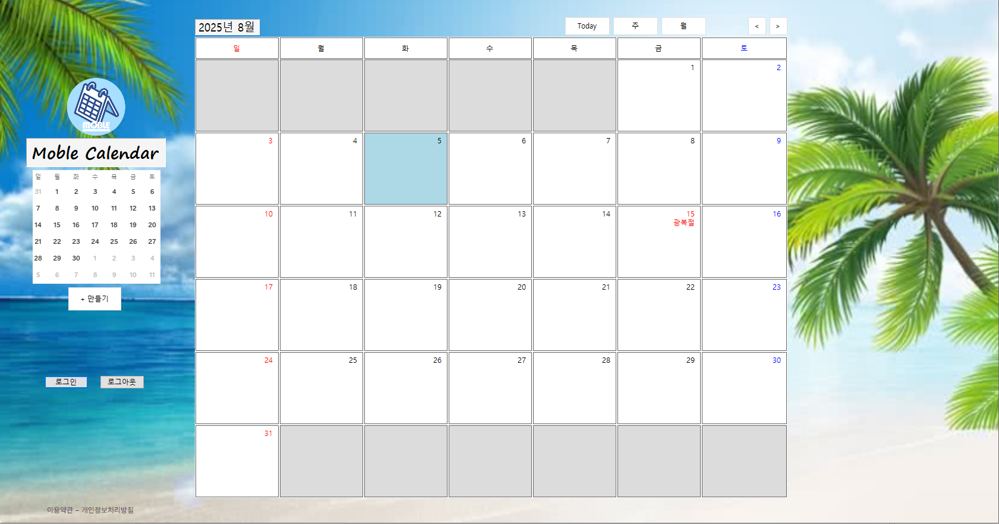

# C# WinForms 기반 MDI 일정 관리 프로그램
- GitHub를 사용하여 팀원들과 프로그램을 만들며 형상관리에 활용함.
- 시연영상 : https://youtu.be/sHx8aYx18XY?si=O_vKtv4DHXr19nMm

## ★ 프로젝트 소개
- C# WinForms을 기반으로 MDI 기반 일정 관리 프로그램을 구현함.
- 회사 일정관리용 캘린더를 컨셉으로 하여 각 팀별 그룹일정을 공유할 수 있게 설계함.
- 사용자 로그인 시 캘린더 UI가 표시되도록 구성하였으며, MySQL과 연동하여 저장된 사용자 일정을 UI에 시각적으로 표시하였음.
- 사용자가 UI에서 특정 날짜를 선택하여 일정을 직접 추가 및 삭제할 수 있는 기능을 구현함. 부가적으로 날짜 검색 기능을 통해 검색 시 해당 날짜가 포함된 달력으로 이동하도록 구현함.
- 사용자 환경설정 기능으로 기본 테마, 계절별 자동 테마 변경 기능을 구현하였으며, 단축키 기능을 추가하여 프로그램 사용 편의성을 강화함.

## ★ 프로젝트 개요

| 구분 | 내용 |
|------|------|
| 프로젝트 규모 | 팀 프로젝트 / 6인 |
| 프로젝트 기간 | 2025.08.02 ~ 2025.08.07 |
| 담당 분야 | GUI / API 활용 공휴일 구현 / MySQL 테이블 설계 |

## ★ 사용 기술
- **사용 기술** : Visual Studio C# WinForms, MySQL
- **사용 언어** : C#

## ★ 담당 역할
### 캘린더 UI 및 기능 구현
- 주간/월간 뷰를 Panel 기반으로 구성하고, Button을 통해 화면 전환이 가능하도록 구현 
- DateTime함수를 활용하여 해당년도 월별 총 일 수를 계산하여 날짜가 없는 Panel은 비활성화 
- 실제 캘린더와 유사하게 날짜별 Panel 클릭 시 선택 영역이 하이라이트되도록 기능을 구현

### 캘린더 UI 계절별 테마변경 구현
- 기존 상용 캘린더와의 차별화를 위해 UI 백그라운드 이미지를 봄(3 ~ 5월), 여름(6 ~ 8월), 가을(9 ~ 11월), 겨울(12 ~ 2월) 시즌별로 자동 변경하는 기능을 구현 
- 해당 테마는 상시 강제 적용 방식이 아닌 단축키 기능과 연동하여 기본 테마(White)와 자유롭게 전환

### API활용 한국의 양력/음력 공휴일 구현
- 양력 공휴일은 Dictionary 형태로 저장하여 달력에 Label로 표기되게 구현 
- 음력 공휴일의 경우 System의 KoreanLunisolarCalendar API를 활용해 Label에 반영 

### MySQL User 테이블 설계
- 사용자 일정 및 데이터를 구분하기 위해 User 테이블을 설계 
- Column은 Name(유저 이름), username(유저 ID), Password(유저 PWD), Group_name(속한 그룹)으로 구성 
- 테이블 설계를 통해 사용자별 캘린더 UI에 표기되는 일정이 각각 다르게 구현 

## ★ 실행화면
- 이미지 클릭 시 시연영상이 재생됩니다.

